# 详细设计

## 学生中心设计

此部分显示个人的全部信息，目前分为以下几个子页面：

### 个人信息主页

个人信息主页的内容以卡片形式呈现，主要内容包括了个人导航、最新消息提醒、参与课程概览、成绩概览、前四次提交记录、部分统计信息可视化的卡片。
个人主页的主要目的就是让学生可以简单直观地分析数据，如果学生想要了解更多信息，每一张卡片的右上角都有详情页，可以看到相关的全部信息。
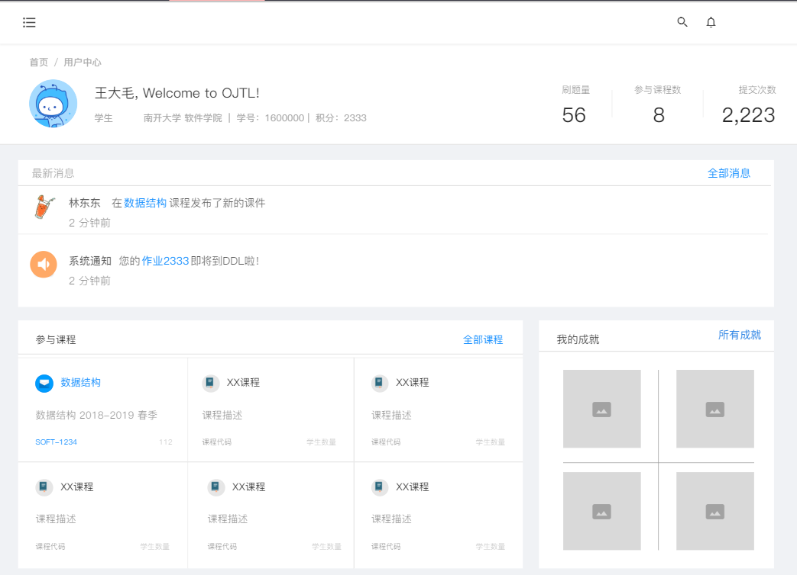

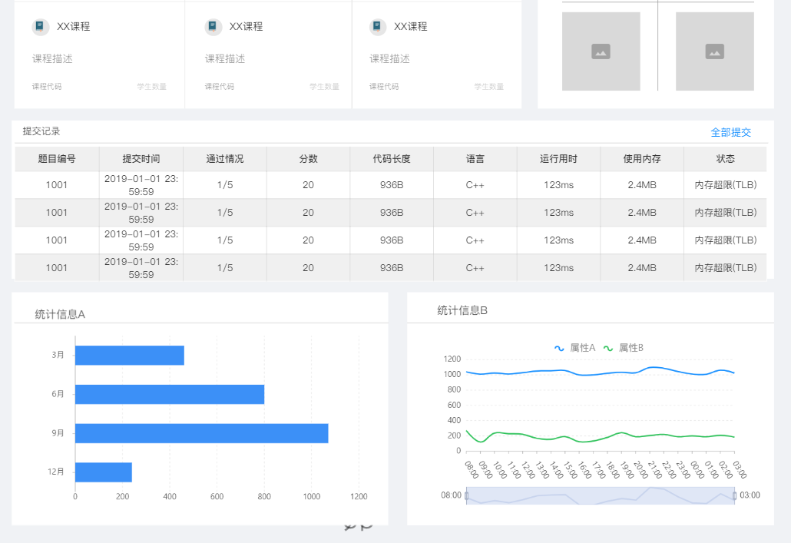

学生的设置存在有激励机制，通过建立积分系统鼓励学生做题，添加一个学生关注功能，每一个学生可以关注一定数量的其他学生，并且可以
查看其他的学生的答题情况  

### 个人信息统计页面

展示学生所做题目的提交结果情况，主要依据学生本学期所修的课程分别可视化
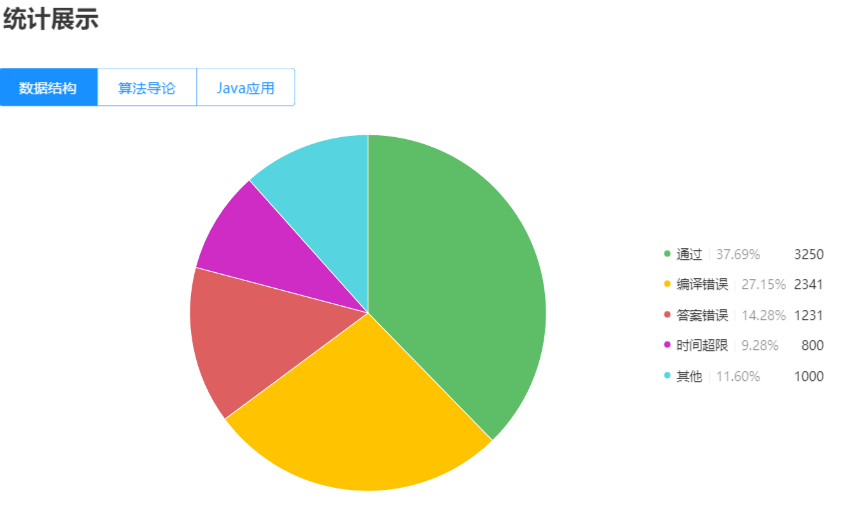

以学生所做题目、AC题目、每日做题时间等作为因子，加权之后得出的量值作为排名依据
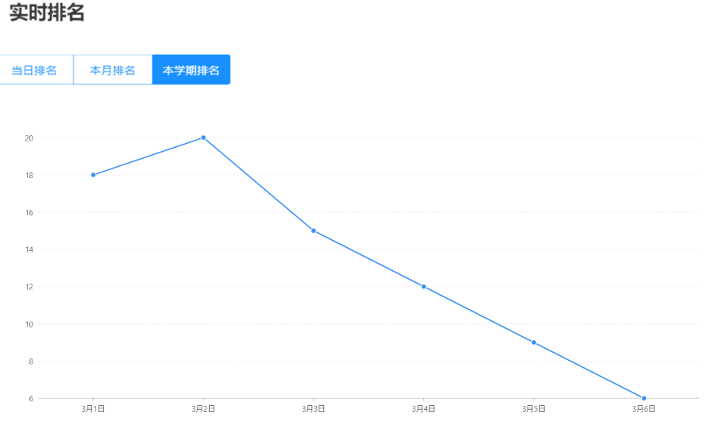

显示学生在每个课程中取得的最新排名
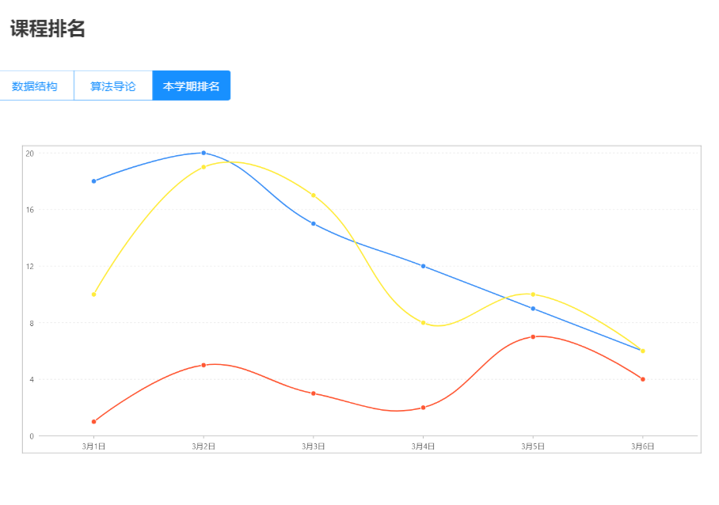

通过词云的方式，显示学生的课程、题目的掌握情况，更加直观
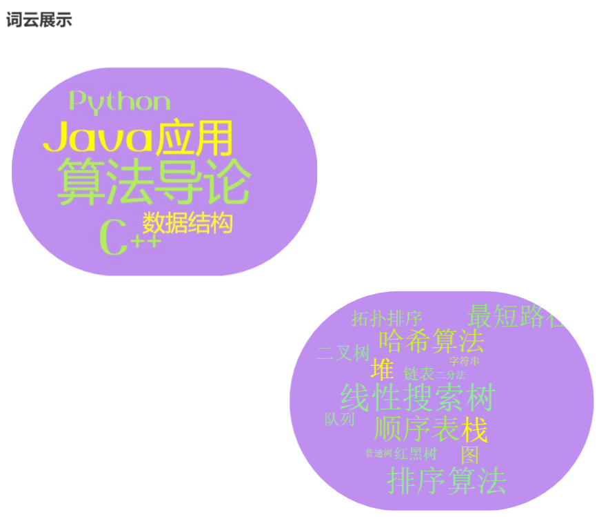

### 个人成就界面

根据学生各个方面的信息，进行个性化展示，达到激励的目的
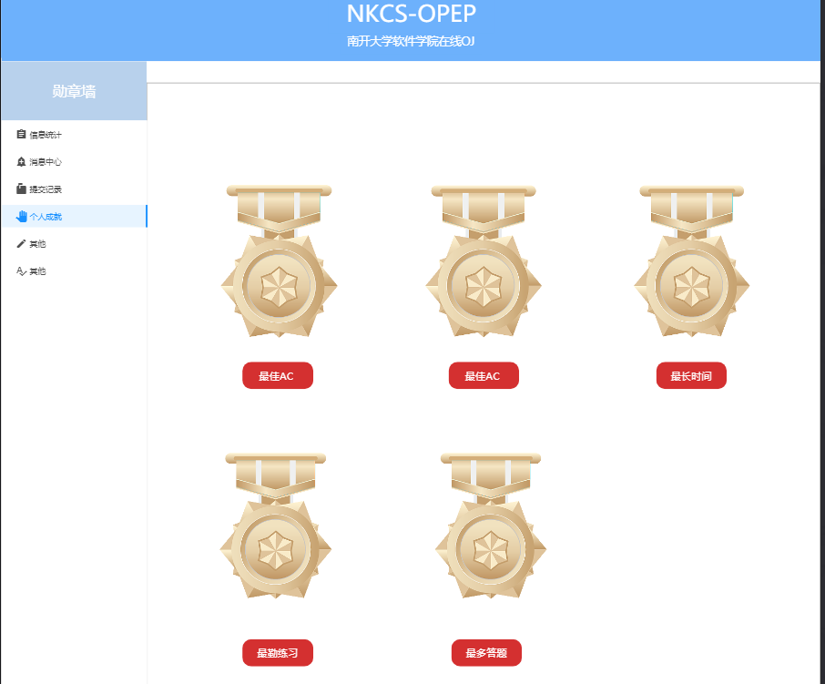

### 个人消息接收页面

用于学生的消息接收，主要为各位教师发送的公告，以及由系统发布的通知
公告信息以及系统通知的主要链接为课程界面中的公告页以及题目的详情页（下图中的蓝字部分内容）

### 个人提交记录页面

展示学生所有题目的提交情况，以表格的形式展示。每一行是一个提交记录，每一条提交记录包括：题目编号，提交时间，通过情况，分数，代码长度，语言，时空使用情况，状态几条属性。

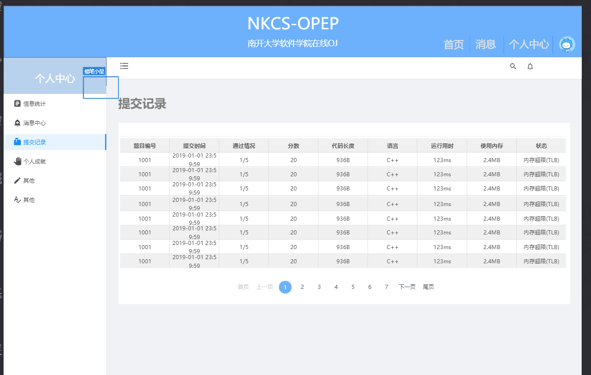

所有的提交记录按照时间排序，最近提交记录在最前页。

### 用户消息推送功能

为了提高学生对系统的黏着度，我们初步的想法除了签到获得积分以外，还有微信/邮箱信息推送功能，可以为同学们推送最新的计算机科学前沿消息，从而达到提高学生访问次数和访问时间的目的。

## 统计中心设计

这部分的主要内容为设计学生的统计中心，用于在学生点击月度报告时进行展示  
为学生提供类似于网易云音乐的年度总结报告的OJ提交报告，生成后，会在学生的个人消息中心中完成提示  
以邮件的形式提供报告链接  
以微信提醒的方式提交给学生
可以将年度报告最终以word/pdf/png等方式导出  

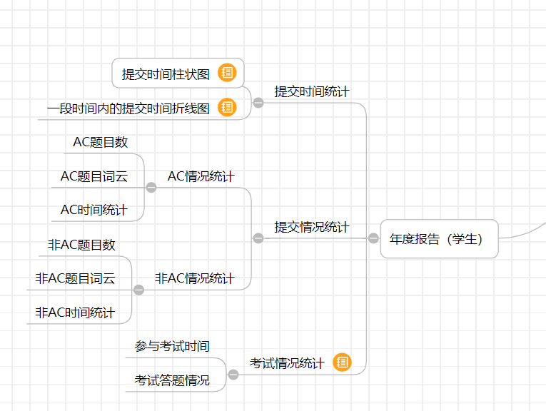

### 提交时间统计

提交时间统计主要包含两方面：

#### 提交时间的柱状图

用于统计学生在24小时内的提交情况，分别提供按照月份统计的每个月的提交时间柱状图，统计学生可能在哪一个时间段内提交的次数较多，并最终以
柱状图的形式显示在学生的月度报告中

#### 提交时间折线图：

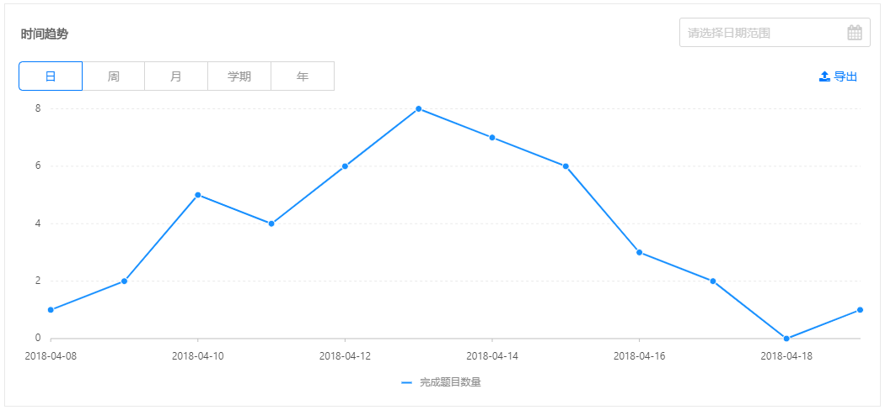
用于统计在一段时间内学生的提交情况，使用折线图来进行表示，也可以采用github上的时间图来进行表示（见下图）
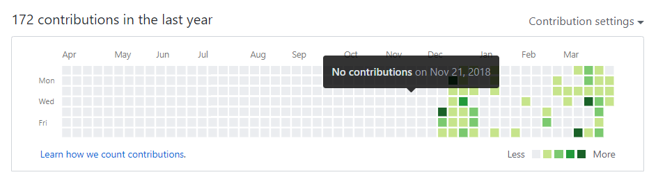

### 提交情况统计

#### AC情况统计

AC情况统计主要分析的是AC题目类型，以及AC的相关提交信息，以及针对于AC的题目类型建立的词云与以及提交时间统计图（折线图/柱状图）

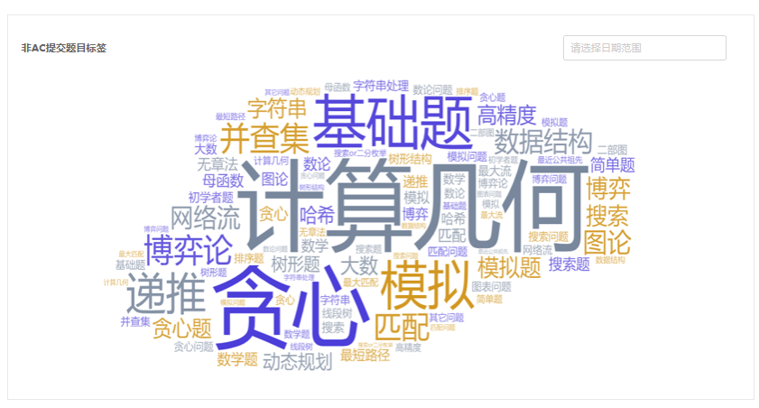
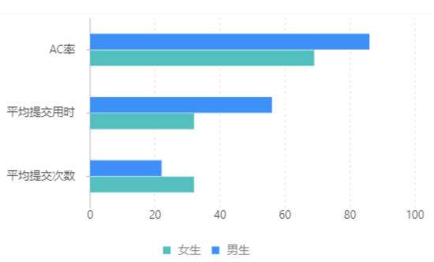

#### 非AC情况统计

非AC情况统计主要分析的是非AC题目数，以及针对于非AC的题目类型，以及测试用例建立的词云与提交时间统计图（折线图/柱状图）
非AC题目有一部分额外的内容，其中包括了错误类型的饼状图分析

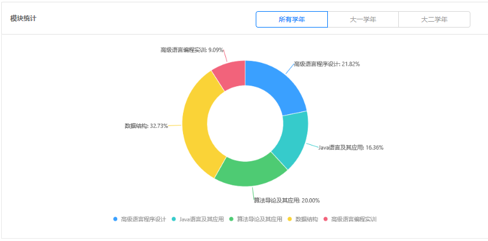

### 考试情况统计

主要针对于考试情况的统计报告，统计每一个学生参与考试的信息，主要包括完成考试的时间，考试过程中的答题情况（题目类别，答题时间）

### 特殊成就统计

用于展示学生的特殊成就，主要和勋章墙的部分内容相关联，以及通过展示一些不会直接在学生统计中心可见的信息，可以包含以下几部分内容

- 个人勋章展示（学生的个人成就部分）
- 这学期最晚几点还在提交代码
- 这学期的所有任务中从开始到通过花费时间最短的一次
- 这学期在某一天提交的次数最多
- 这学期在某一道题目的提交的次数最多
- ……

关于勋章墙的设置，需要将勋章墙的内容展示到用户的首页上  
